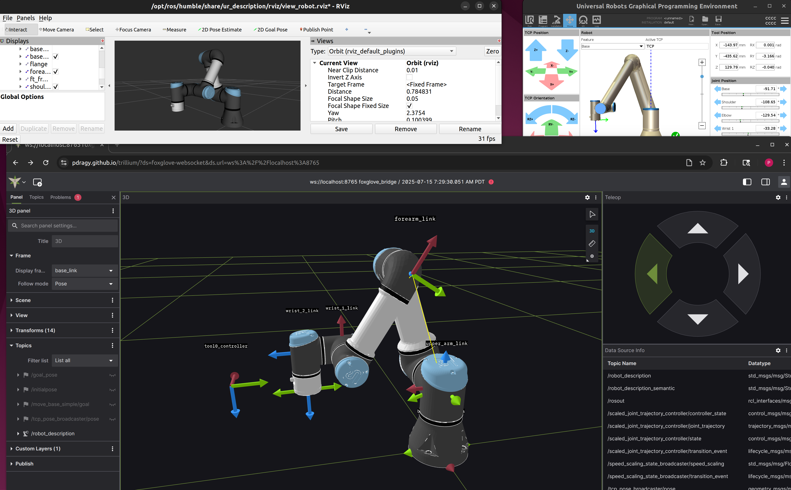

## Installation

## About

Trillium is a free, open source web app for robotics.



## Web

Note: Only Chrome is fully supported at this time. Uploading local files won't work in Firefox.

To run the web version of trillium, either

1. Visit the github page: [https://pdragy.github.io/trillium](https://pdragy.github.io/trillium)
2. Run it offline locally, by downloading the packaged site in the Releases section of Github, and serving them locally, for example on linux:
```
unzip trillium.zip
python -m http.server 8080 --directory trillium
```
OR
3. Build and run the docker container locally:

```
docker build -t trillium .
docker run --rm -it -p 8080:8080 trillium
```

For 2 or 3, visit http://localhost:8080 in your browser.

For more ways to build and run the code, see CONTRIBUTING.md

## Desktop

In the Releases section in Github, download the latest installer for your platform (only Windows and Linux available at this time).

To build the Desktop application, see CONTRIBUTING.md

## History and related projects

Trillium is a fork of Foxglove, and Foxglove was built/copied from [webviz](https://github.com/cruise-automation/webviz). Last known release of open-sourced Foxglove studio v1 before it was deleted and taken private was 1.87.0, and last commit was [56620d2](https://github.com/pdragy/trillium/commit/56620d28a684503a50f6c793b41b11e968b08254)

Foxglove v1.87.0 is availabile under the [Mozilla Public License v2.0](https://github.com/pdragy/trillium/blob/56620d28a684503a50f6c793b41b11e968b08254/LICENSE).

[Lichtblick](https://github.com/lichtblick-suite/lichtblick) is another fork of Foxglove, maintained by BMW. It became the parent repo of foxglove/studio forks when foxglove/studio commit history was deleted.

